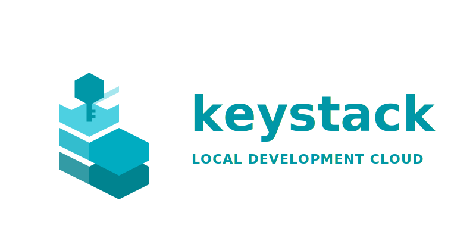

<p align="center">
  
</p>

**Keystack** is an open-source AWS cloud emulator written in **Kotlin** (JVM). It provides a modular, high-performance, and permissively licensed alternative to LocalStack, designed for modern cloud-native development and testing.

## Why Keystack?

- **Kotlin-First:** Built from the ground up with Kotlin 2.1+, leveraging Coroutines for high-concurrency and structured concurrency.
- **High Performance:** Lightweight Ktor-based gateway and efficient in-memory state management.
- **Modular Architecture:** Easily extendable with new AWS service providers and protocol parsers.
- **Permissive License:** Licensed under Apache License 2.0, making it suitable for both personal and commercial use.
- **Modern Lambda Engine:** Full support for container-based Lambda execution with warm container reuse and hot reloading.

## Architecture

Keystack follows a modular architecture inspired by LocalStack but optimized for the JVM ecosystem:

- **Gateway (`keystack-gateway`):** A Ktor-based asynchronous HTTP server that handles all incoming AWS requests.
- **Protocol Engine (`keystack-protocol`):** Detects, parses, and serializes requests across multiple AWS protocols (Query, JSON, REST-XML).
- **Service Providers (`keystack-provider`):** A plugin-based system where AWS services are implemented as modular providers.
- **State Management (`keystack-state`):** Account and region-isolated state stores with snapshot support.

## Supported Services

| Service | Protocol | Status | Highlights |
|---------|----------|--------|------------|
| **SQS** | Query/JSON | ✅ Stable | Standard & FIFO queues, long polling, DLQs |
| **S3** | REST-XML | ✅ Stable | Bucket/Object CRUD, Filesystem storage, Path-style addressing |
| **DynamoDB**| JSON/CBOR | ✅ Stable | In-memory table/item store, Attribute-level operations |
| **Lambda** | REST-JSON | ✅ Stable | Container-based execution, warm reuse, hot reloading |
| **SNS** | Query | ✅ Stable | Topic management, SQS/HTTP/Lambda subscriptions |
| **IAM** | Query | ✅ Permissive | Identity tracking, mock role/policy management |
| **STS** | Query | ✅ Mock | GetCallerIdentity, AssumeRole support |
| **CloudWatch**| Query | ✅ Partial | Metric storage (Put/Get), Alarms |
| **CloudFormation**| Query | ✅ Partial | Template engine, Stack CRUD for core services |

## Lambda Features

Keystack's Lambda implementation is designed for rapid development:

- **Warm Container Reuse:** Containers are kept alive after invocation, eliminating cold starts for subsequent requests.
- **Hot Reloading:** Point your function to a local directory using `file://` URIs to reflect code changes instantly without redeployment.
- **Multiple Runtimes:** Supports Python (3.9-3.13), Node.js (18-22), Java (17, 21), .NET 8, and Ruby 3.3.
- **Provisioned Concurrency:** Pre-warm containers to ensure zero-latency starts for critical functions.

## Getting Started

### Prerequisites

- [Docker](https://docs.docker.com/get-docker/) (Required for Lambda)
- [JDK 21+](https://adoptium.net/) and [Gradle](https://gradle.org/install/) (for local development)

### Running with Docker (Recommended)

```bash
cd keystack
docker compose up --build
```

### Running Locally with Gradle

```bash
cd keystack
./gradlew :keystack-cli:run --args="start"
```

The emulator listens on `http://localhost:4566` by default.

## Using with AWS CLI

Specify the `--endpoint-url` to point to Keystack:

```bash
# SQS Example
aws --endpoint-url=http://localhost:4566 sqs create-queue --queue-name test-queue

# Lambda Hot Reloading Example
aws --endpoint-url=http://localhost:4566 lambda create-function \
    --function-name my-func \
    --runtime python3.12 \
    --role arn:aws:iam::000000000000:role/lambda-role \
    --handler index.handler \
    --code S3Key="file://$(pwd)/my-function-dir"
```

## Internal API

Keystack provides internal endpoints for health monitoring and state management:

- `GET /_keystack/health`: Returns the current system status.
- `POST /_keystack/state/reset`: Resets all service states to a clean slate (useful for test isolation).

## Configuration

| Variable | Default | Description |
|----------|---------|-------------|
| `KEYSTACK_GATEWAY_LISTEN` | `0.0.0.0:4566` | Host and port to listen on |
| `KEYSTACK_LOG_LEVEL` | `INFO` | Logging level (TRACE, DEBUG, INFO, WARN, ERROR) |
| `KEYSTACK_PERSISTENCE` | `false` | Enable/Disable state persistence to disk |
| `KEYSTACK_LAMBDA_KEEPALIVE_MS` | `600000` | Idle timeout before stopping warm containers (10 min) |
| `KEYSTACK_LAMBDA_STARTUP_TIMEOUT_MS`| `20000` | Max time to wait for container startup (20s) |
| `KEYSTACK_LAMBDA_MAX_CONCURRENT_STARTS`| `16` | Max simultaneous cold starts |

## License

This project is licensed under the Apache License 2.0 - see the [LICENSE](LICENSE) file for details.
